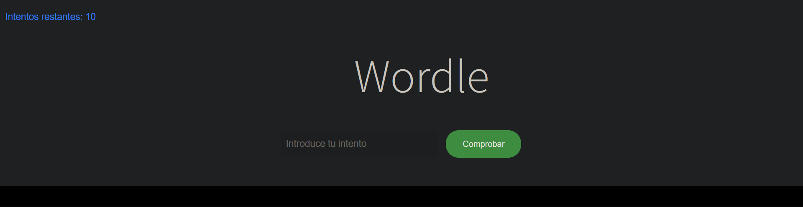
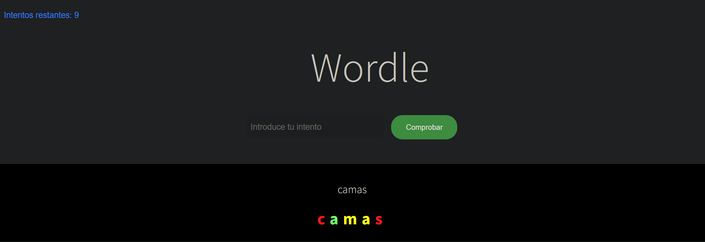
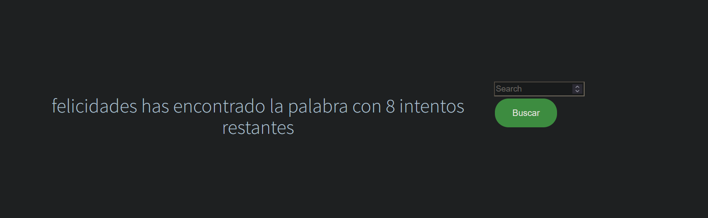
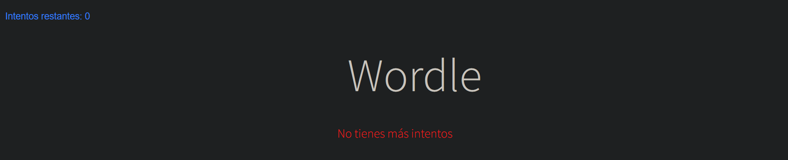
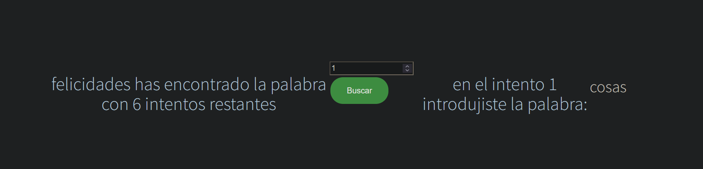
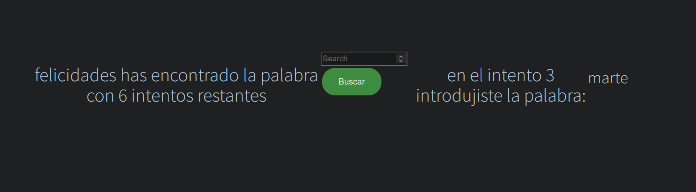

# Wordle

Un wordle es un juego de adivinanzas en el que intentas adivinar una palabra y cada intento obtienes pistas sobre la palabra oculta.

Wordle is a riddle games where you try and guess a word and with each attempt you gain hints about the hidden word. 

## Cómo jugar // How to play

Para comenzar, ejecute el archivo `Wordle.java`, abra en su navegador una pestaña y escriba localhost:8080/ . El programa le pedirá que ingrese una palabra de diferentes longitudes dependiendo de la dificultad que el usuario haya escogido en el archivo `applicaction.properties` bajo la carpeta `main/resources`, el usuario puede escoger entre 3 niveles de dificultad:Facil, con una palabra a adivinar de 3 letras de longitud y 20 intentos;
medio, con una palabra a adivinar de 5 letras y 10 intentos; y dificil, con una palabra a adivinar de 8 letras y 5 intentos.

To start playing, execute the file `Wordle.java`. open a new tab on your internet browser and type in localhost:8080/ . The program will ask for a word of different lengths depending on the dificulty choosen by the user on the archive `applicaction.properties` under the route `main/resources`, the user can choose between 3 different difficulty levels: facil, with a word of 3 letters of length and 20 attempts; medio, with a 5 letters of length word and 10 attempts; and hard, with a 8 letters of lenght word and 5 attemps.

Después de cada intento, recibirá una lista de letras que adivinó correctamente y en qué posición. También recibirá una lista de letras que no están en la palabra.

After each attempt, the user will recibe a list of letters with the ones he guessed right and on which position they were it they were correct. It will also provide the information of which letters were not in the word.

Si adivinas la palabra en el numero de intentos acorde a la dificultad o menos, ¡ganas el juego! De lo contrario, pierdes.

If you guess the word under the number of attempts according to the difficulty chosen or under, you win the game! Otherwise, you lose.

En la pantalla de victoria puedes usar el buscador que aparece en la pantalla para ver los intentos realizados previamente.

In the victory screen you can also use the searcher that appears on the screen to look at the attempts done before. 

## Cómo funciona el código // How does the code work

El programa está escrito en Java y usa el framework Spring para manejar la lógica de negocio.
The program is written on Java and uses the Spring framework to administer the logic of the program.

La clase `PalabraPorLetras` representa una letra a adivinar y su posición. La clase `IPalabraRepo` define la interfaz para un repositorio de palabras y la clase `PalabraRepo` implementa esta interfaz utilizando una lista de palabras predefinidas.
The class `PalabraPorLetras` represents a word to guess and its position. The class `IPalabraRepo` defines the interface for a words repository and the class `PalabraRepo` implements that interface using a list of words predefined.

La clase `PalabrasService` maneja la lógica principal del juego. Utiliza el repositorio de palabras para verificar las adivinanzas del usuario y mantiene un registro de intentos anteriores.
The class `PalabrasService` handles the main logic of the game. Uses the repository of word to verify the guessings of the user and has a log of the previous attempts.

## Cómo probar el código // How to check the code

El código incluye un conjunto de pruebas unitarias escritas utilizando JUnit 5. Estas pruebas verifican el comportamiento de la clase `PalabrasService` en una variedad de situaciones.
The code includes some unitary tests written on JUnit 5. These tests verify how the class `PalabrasService` works on a variety of situations.

Para ejecutar las pruebas, simplemente ejecute el archivo `PalabrasServiceTest.java`. Para poder comprobar los tests has de tener la dependencia de JUnit instalada en el equipo.
To execute the tests, just run the file `PalabrasServiceTest.java`. To check the tests you must have the JUnit dependency installed on the system.

## Autores // Autors

Este proyecto fue desarrollado por [Javier Burillo](https://github.com/SaijaxS).
This proyect was developed by [Javier Burillo](https://github.com/SaijaxS).

